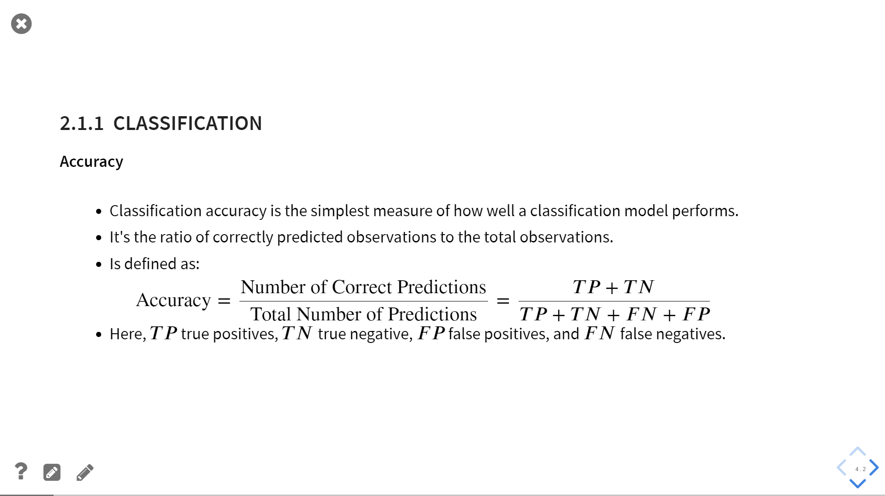
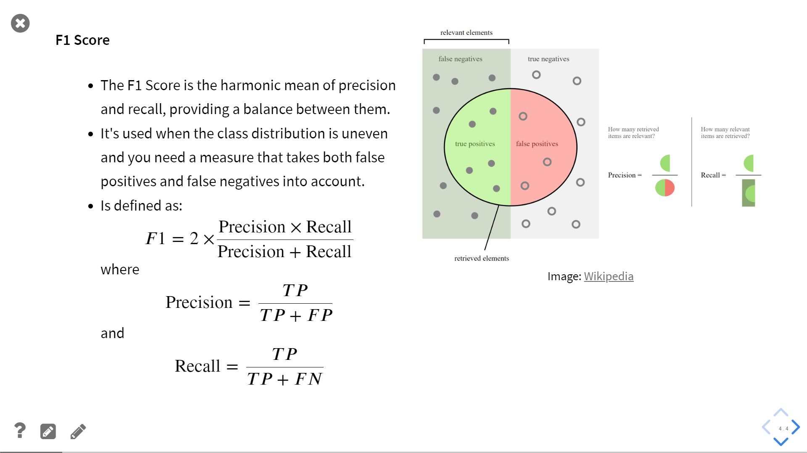

<br>
<div align="center">
📚 <a href="">Read the book</a> 📚
</div>
<br>

This is the collection of notebooks for the course *Time Series Analysis with Python*.
For more information and for reading the content of this repository, please refer to the [book]() version.


## 🚀 Getting started with coding

To run the notebooks the recommended steps are the following:

1. Download and install [Miniconda](https://docs.conda.io/projects/miniconda/en/latest/miniconda-install.htmlLinks).

2. Download the [env.yml](env.yml) file.

3. Open the shell and navigate to the location with the yml file you just downloaded.
    - If you are on Windows, open the Miniconda shell.

4. Install the environment with 
   ```{bash}
   > conda env create -f env.yml
   ```

5. Activate your environment: 
   ```{bash}
   > conda activate pytsa
   ```

6. Go to the folder with the notebooks

7. Launch Jupyter Lab with the command 
   ```{bash}
   > jupyter lab
   ```

## 🎥 Notebook format and slides

The notebooks are structured as a sequence of slides to be presented using [RISE](https://rise.readthedocs.io/en/latest/).
If you open a notebook you will see the following structure:


The top-right button indicates the type of slide, which is stored in the metadata of the cell. To enable the visualization of the slide type you must first install RISE and then on the top menu select `View -> Cell Toolbar -> Slieshow`. Also, to split the cells like in the example, you must enable `Split Cells Notebook` from the [nbextensions](https://jupyter-contrib-nbextensions.readthedocs.io/en/latest/index.html).

By pressing the `Enter\Exit RISE Slideshow` button at the top you can enter the slideshow presentation.





See the [RISE documentation](https://rise.readthedocs.io/en/latest/) for more info.
