<section style="background-image: url('media/slide_header.jpg'); background-size: contain; background-repeat: no-repeat; background-position: center; height: 100vh;">
  <h1 style="font-size: 2em; margin-top: 25vh">Introduction to time series analysis</h1>
</section>

---

## Introduction

In this lecture we will cover the following topics:

- Definition of time series data.
- Introduction to time series analysis and application examples.
- The main components of a time series.
- Time series decomposition.

--

<section>
  <pre><code data-trim data-noescape>
#Imports
import numpy as np
import matplotlib.pyplot as plt
import statsmodels.api as sm

from statsmodels.tsa.seasonal import seasonal_decompose, STL
from scipy.fft import fft
np.random.seed(0)  # for reproducibility
  </code></pre>
</section>

---

## Basics

---

### What is a time series?

- A time series is a sequence of data points organized in time order.
- Usually, the time signal is sampled at equally spaced points in time.
- These can be represented as the sequence of the sampled values.


--

- Irregularly sampled time signals can still be represented as a time series.
- It is necessary to encode this additional information into an additional data structure.

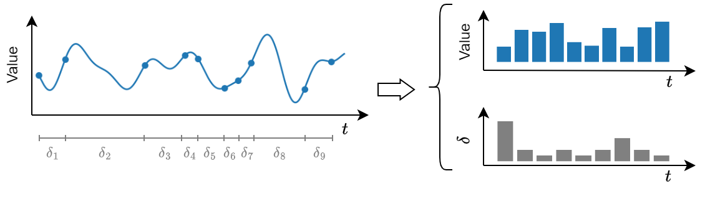

---

### What data are represented as time series?

- Time series are found in a myriad of natural phenomena, industrial and engineering applications, business, human activities, and so on.

--


--


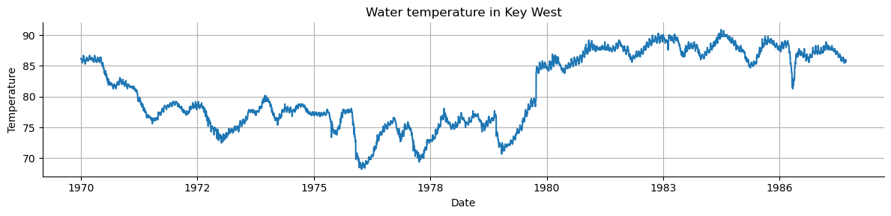

--

- Other examples include data from:
    - Finance: stock prices, asset prices, macroeconomic factors.
    - E-Commerce: page views, new users, searches.
    - Business: transactions, revenue, inventory levels.
    - Natural language: machine translation, chatbots.

---

### Time series analysis

The main purposes of time series analysis are:
<ol>
    <li class="fragment">To <strong>understand</strong> and characterize the underlying process that generates the observed data.</li>
    <li class="fragment">To <strong>forecast</strong> the evolution of the process, i.e., predict the next observed values.</li>
</ol>

--

- There are two main different perspectives to look at a time series: *statistical perspective* and *dynamical system perspective*
- Each perspective leads to different time series analysis approaches

--

#### Statistics perspective

<ul>
<li class="fragment">A time series is a sequence of <strong>random variables</strong> 
$$
\{x_t\}_{t\in\mathbb{Z}}=\{x_1,x_2,x_3,\dots\}
$$</li>
<li class="fragment">Realization of a stochastic process</li>
<li class="fragment">Statistical approach: finding the parameters of the stochastic process that most likely produced the observed time series</li>
</ul>

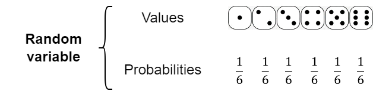

--

#### Dynamical system perspective

<ul>
    <li class="fragment">Dynamical system governed by unknown variables $\dot x_i=F(x_1,\dots,x_𝑁)$</li>
    <li class="fragment">We observe the dynamics of $y=f(x_1,\dots,x_𝑁)$</li>
    <li class="fragment">The objective of the analysis is to reconstruct the dynamics of the entire system from $y$</li>
</ul>


---

### Applications

Time series analysis is applied in many real world applications, including
- Economic forecasting
- Stock market analysis
- Demand planning and forecasting
- Anomaly detection
- … And much more

--

#### Economic Forecasting

- Time series analysis is used in macroeconomic predictions
- World Trade Organization does time series forecasting on international trade [[source](https://www.wto.org/english/blogs_e/ce_ralph_ossa_e/blog_ro_11oct24_e.htm)]
- Federal Reserve uses time series forecasts of the economy to set interest rates [[source](https://www.federalreserve.gov/pubs/feds/2009/200910/200910pap.pdf)]

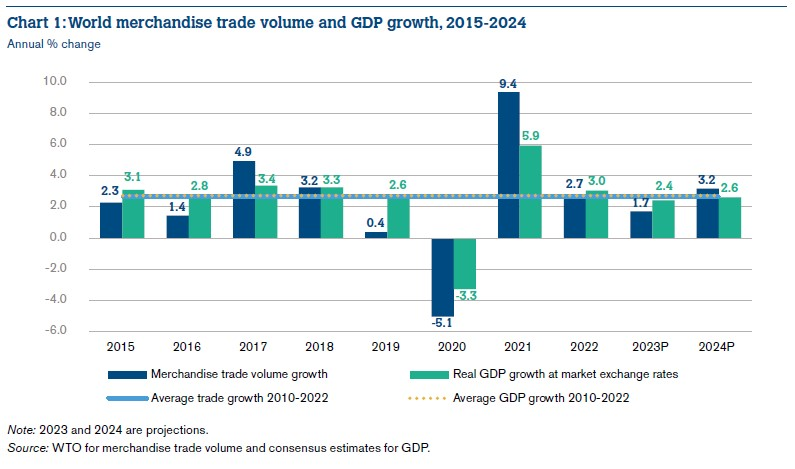

--

#### Demand forecasting

- Time series analysis is used to predict demand
- Amazon's *anticipatory shipping*: it uses time series modeling to predict demand [[source](https://patents.google.com/patent/US8086546B2/en)]
- Helps meet customer needs (fast shipping) and reduce inventory waste

--

#### Anomaly detection

- Detect anomalous behaviours by looking at unusual patterns
- Detect defects in manifacturing and target preventive maintenance [[source](https://papers.phmsociety.org/index.php/phme/article/view/1256/phmec_20_1256)].
- With new IoT devices, anomaly detection is being used in machinery heavy industries, such as petroleum and gas [[source](https://arxiv.org/abs/1607.02480)].

---

## Time series components
- A time series is often assumed to be composed of three components:
    - *Trend*: the long-term direction
    - *Seasonality*: the periodic behavior
    - *Residuals*: the irregular fluctuations

---

### Trend


<ul>
    <li class="fragment">Trend captures the general direction of the time series.</li>
    <li class="fragment">Trend can be increasing, decreasing, or constant.</li>
    <li class="fragment">It can increase/decrease in different ways over time (linearly, exponentially, etc…).</li>
</ul>


--

- Let's create a trend from scratch to understand how it looks like.

<section>
  <pre><code data-trim data-noescape class="fragment">
  time = np.arange(144)
  trend = time * 2.65 + 100
  </code></pre>

  <pre><code data-trim data-noescape class="fragment">
fig, ax = plt.subplots(1, 1, figsize=(10, 3))
ax.plot(time, trend, color='tab:red')
ax.set_xlabel("Months")
ax.set_ylabel("Passengers")
plt.grid()
plt.title("Trend vs Time")
  </code></pre>
</section>

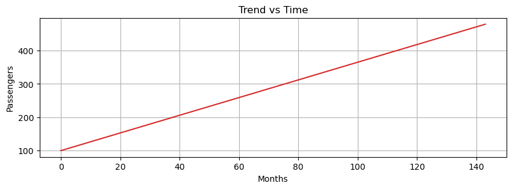

---

### Seasonality

- Periodic fluctuations in time series data that occur at regular intervals due to seasonal factors.
- It is characterized by consistent and predictable patterns over a specific period (e.g., daily, monthly, quarterly, yearly).

--

It can be driven by many factors:
- Naturally occurring events such as weather fluctuations caused by time of year.
- Business or administrative procedures, such as start and end of a school year.
- Social or cultural behavior, e.g., holidays or religious observances.

--

- Let's generate the seasonal component

<section>
  <pre><code data-trim data-noescape class="fragment">
seasonal = 20 + np.sin( time * 0.5) * 20
  </code></pre>
  <pre><code data-trim data-noescape class="fragment">
fig, ax = plt.subplots(1, 1, figsize=(10, 3))
ax.plot(time, seasonal, color='tab:orange')
ax.set_xlabel("Months")
ax.set_ylabel("Passengers")
plt.grid()
plt.title("Seasonality vs Time")
  </code></pre>
</section>


---

### Residuals

- Residuals are the random fluctuations left over after trend and seasonality are removed from the original time series.
- One should not see a trend or seasonal pattern in the residuals.
- They represent short term, rather unpredictable fluctuations.

--

<section>
  <pre><code data-trim data-noescape class="fragment">
residuals = np.random.normal(loc=0.0, scale=3, size=len(time))
  </code></pre>
  <pre><code data-trim data-noescape class="fragment">
fig, ax = plt.subplots(1, 1, figsize=(10, 3))
ax.plot(time, residuals, color='tab:green')
ax.set_xlabel("Months")
ax.set_ylabel("Passengers")
plt.grid()
plt.title("Residuals vs Time")
  </code></pre>
</section>

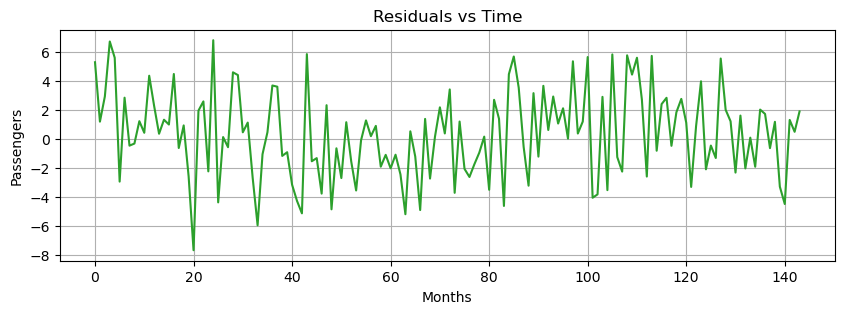

---

## Decomposition Models
- Time series components can be decomposed with the following models:
    1. Additive decomposition
    2. Multiplicative decomposition
    3. Pseudoadditive decomposition

---

### Additive model

<ul>
    <li class="fragment">Additive models assume that the observed time series is the sum of its components:
    $$X(t) = T(t) + S(t) + R(t)$$</li>
    <li class="fragment">Additive models are used when the magnitudes of the seasonal and residual values do not depend on the level of the trend.</li>
</ul>

--

<section>
  <pre><code data-trim data-noescape>
additive = trend + seasonal + residuals
  </code></pre>
</section>

<section>
  <pre><code data-trim data-noescape>
fig, ax = plt.subplots(1, 1, figsize=(10, 3))
ax.plot(time, additive, 'tab:blue')
ax.set_xlabel("Months")
ax.set_ylabel("Passengers")
plt.title("Additive Time Series")
plt.grid()
  </code></pre>
</section>

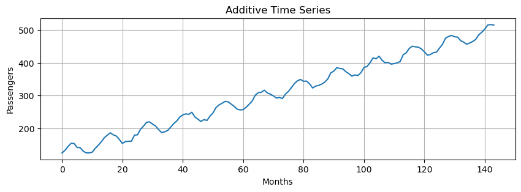

---

### Multiplicative Model

<ul>
    <li class="fragment">Time series is the product of its components
    $$X(t) = T(t) \cdot S(t) \cdot R(t)$$</li>
    <li class="fragment">Transform a multiplicative model to additive
    $$
    \begin{aligned}
    &\log(T(t) \cdot S(t) \cdot R(t)) = \\
    &=\log(T(t)) + \log(S(t)) + \log(R(t))
    \end{aligned}
    $$</li>
    <li class="fragment">Used when the magnitudes of seasonal and residual values depend on the trend</li>
</ul>

--

<section>
  <pre><code data-trim data-noescape>
multiplicative = trend * seasonal 
# we do not include the residuals 
# to make the pattern more clear
  </code></pre>
</section>

<section>
  <pre><code data-trim data-noescape>
fig, ax = plt.subplots(1, 1, figsize=(10, 3))
ax.plot(time, multiplicative, 'tab:blue')
ax.set_xlabel("Months")
ax.set_ylabel("Passengers")
plt.title("Multiplicative Time Series")
plt.grid()
  </code></pre>
</section>


---

### Pseudoadditive Model

<ul>
    <li class="fragment">Combination of the additive and multiplicative models</li>
    <li class="fragment">Useful when:</li>
    <ul>
        <li class="fragment">Time series values are close to or equal to zero. Multiplicative models struggle with zero values.</li>
        <li class="fragment">Some features are multiplicative (e.g., seasonal effects) and others are additive (e.g., residuals).</li>
        <li class="fragment">Complex seasonal patterns or data that do not completely align with additive or multiplicative model.</li>
    </ul>
</ul>

--

Formulation:

<div style="font-size: 0.8em;">
    $$\begin{aligned}
    X(t) &= T(t) + T(t)\cdot(S(t) - 1) + T(t)\cdot(R(t) - 1) = \\
    &= T(t)\cdot(S(t) + R(t) -1)
    \end{aligned}$$
</div>

--

<section>
  <pre><code data-trim data-noescape>
pseudoadditive = trend * (seasonal + residuals - 1)
  </code></pre>
  <pre><code data-trim data-noescape>
fig, ax = plt.subplots(1, 1, figsize=(10, 3))
ax.plot(time, pseudoadditive, 'tab:blue')
ax.set_xlabel("Months")
ax.set_ylabel("Passengers")
plt.title("Pseudoadditive Time Series")
plt.grid()
  </code></pre>
</section>

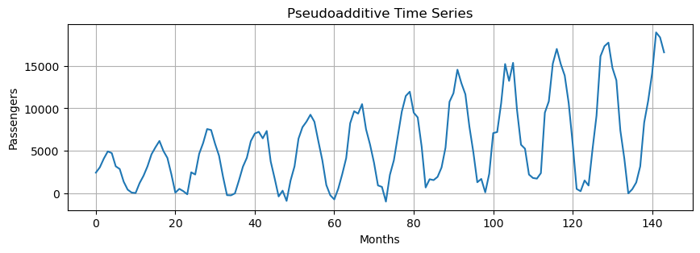

---

## Time Series Decomposition

<ul>
    <li class="fragment">We have additive and multiplicative data.</li>
    <li class="fragment">Let's decompose them into their three components.</li>
    <li class="fragment">A very simple approach is to estimate a <em>linear</em> trend.</li>
    <li class="fragment">A <em>detrended</em> time series is obtained by subtracting the linear trend from the data.</li>
    <li class="fragment">The linear trend is computed as a 1st order polynomial.</li>
</ul>

--

<section>
  <pre><code data-trim data-noescape>
# estimate line coefficient
slope, intercept = np.polyfit(np.arange(len(additive)), 
                                additive, 1)
# linear trend
trend = np.arange(len(additive)) * slope + intercept 
detrended = additive - trend # remove the trend
  </code></pre>
  <pre><code data-trim data-noescape>
plt.figure(figsize=(10, 3))
plt.plot(additive, label='Original')
plt.plot(trend, label='Trend')
plt.plot(detrended, label='Detrended')
plt.grid()
plt.legend()
  </code></pre>
</section>

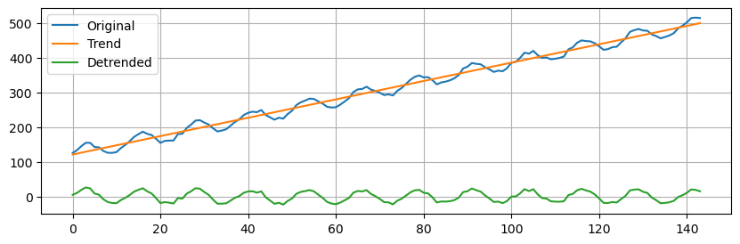

---

### Additive Decomposition

- Next, we will use `seasonal_decompose` (more information [here](http://www.statsmodels.org/dev/generated/statsmodels.tsa.seasonal.seasonal_decompose.html)) to isolate the main time series components.
- This is a simple method that requires us to specify the type of model (additive or multiplicative) and the main period.

--

- We need to specify an integer that represents the main seasonality of the data.
- By looking at the seasonal component, we see that the period is *approximately* $12$ time steps long.
- So, we set `period=12`.


--

<section>
  <pre><code data-trim data-noescape>
additive_decomposition = seasonal_decompose(x=additive, 
                                            model='additive', 
                                            period=12)
  </code></pre>
  <pre><code data-trim data-noescape>
# Utility function to make the plots
def seas_decomp_plots(original, decomposition):
    _, axes = plt.subplots(4, 1, sharex=True, sharey=False, figsize=(7, 5))
    axes[0].plot(original, label='Original')
    axes[0].legend(loc='upper left')
    axes[1].plot(decomposition.trend, label='Trend')
    axes[1].legend(loc='upper left')
    axes[2].plot(decomposition.seasonal, label='Seasonality')
    axes[2].legend(loc='upper left')
    axes[3].plot(decomposition.resid, label='Residuals')
    axes[3].legend(loc='upper left')
    plt.show()

seas_decomp_plots(additive, additive_decomposition)
  </code></pre>
</section>

--

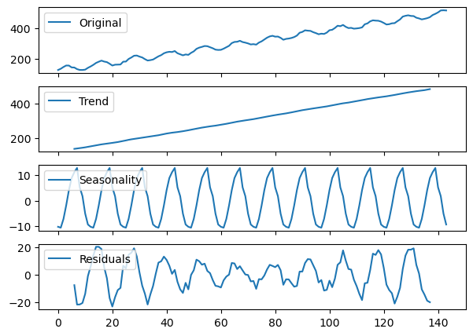

--

- The blue line in each plot representes the decomposition. 
- There is a legend in the upper left corner of each plot to let you know what each plot represents. 
- You can see the decomposition is not perfect with regards to seasonality and residuals, but it's pretty close. 

--

- You may notice both *trend* and *residuals* are missing data towards the beginning and end. 
- This has to do with how trend is calculated (beyond the scope of this lesson). 
- The residuals are missing simply because $R_{t} = Y_{t} - T_{t} - S_{t}$, so missing trend values mean missing residual values as well.

---

### Multiplicative Decomposition

- We use the same function as before, but on the `multiplicative` time series.
- Since we know this is a multiplicative time series, we declare `model='multiplicative'` in `seasonal_decompose`.

--

<section>
  <pre><code data-trim data-noescape>
multiplicative_decomposition = seasonal_decompose(x=multiplicative, model='multiplicative', period=12)
seas_decomp_plots(multiplicative, multiplicative_decomposition)
  </code></pre>
</section>

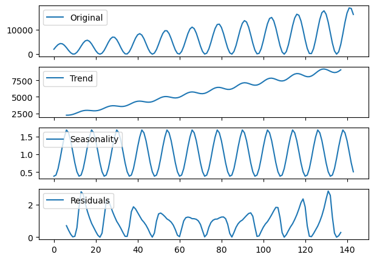

--

- Again, the decomposition does a relatively good job picking up the overall trend and seasonality.
- We can see the shapes follow the patterns we expect. 

---

### Locally estimated scatterplot smoothing (LOESS)
- Next, we try a second method called `STL` (Seasonal and Trend decomposition using LOESS).
- We start with the additive model.

<section>
  <pre><code data-trim data-noescape>
stl_decomposition = STL(endog=additive, 
                        period=12, 
                        robust=True).fit()
seas_decomp_plots(additive, stl_decomposition)
  </code></pre>
</section>

--

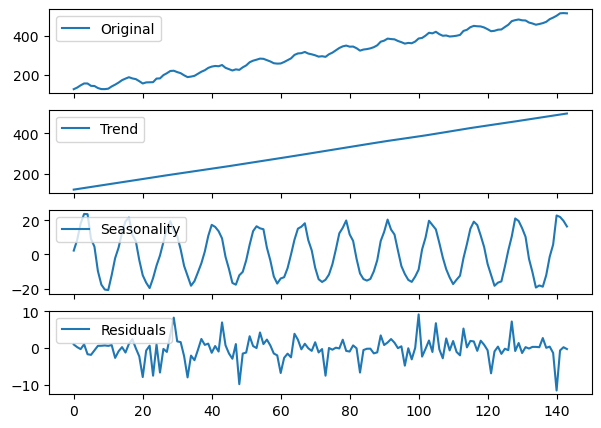

- The STL decomposition does a very good job on the `additive` time series.
- Next, we try with the `multiplicative` one.

--

<section>
  <pre><code data-trim data-noescape>
stl_decomposition = STL(endog=multiplicative, period=12, robust=True).fit()
seas_decomp_plots(multiplicative, stl_decomposition)
  </code></pre>
</section>

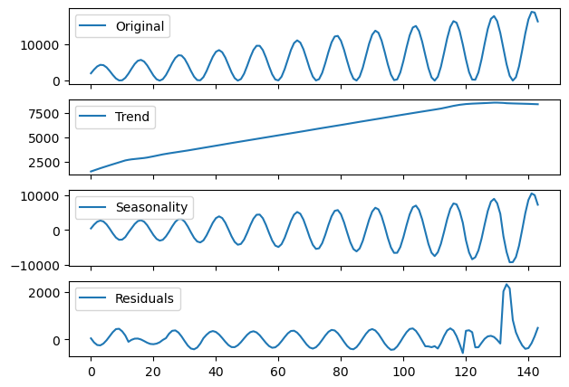

- This decomposition is not as good as the previous one.

---

### Which method to use?

Use ``seasonal_decompose`` when:

- Your time series data has a clear and stable seasonal pattern and trend.
- You prefer a simpler model with fewer parameters to adjust.
- The seasonal amplitude is constant over time (suggesting an additive model) or varies proportionally with the trend (suggesting a multiplicative model).

--

Use ``STL`` when:

- Your time series exhibits complex seasonality that may change over time.
- You need to handle outliers effectively without them distorting the trend and seasonal components.
- You are dealing with non-linear trends and seasonality, and you need more control over the decomposition process.

---

### Identify the dominant period/frequency
- ``seasonal_decompose`` expects the dominant period as a parameter. 
- In the example, we generated the ``seasonal`` component by hand as follows:

````python
seasonal = 20 + np.sin(time * 0.5) * 20
````

--

<ul>
    <li class="fragment">We said that the period was <em>approximately</em> 12</li>
    <li class="fragment">But, in general, how do we find it out? 🤔</li>
    <li class="fragment">You can use one of the following techniques:</li>
    <ul>
        <li class="fragment">Plot the data and try to figure out after how many steps the cycle repeats.</li>
        <li class="fragment">Do an Autocorrelation Plot (more on this later).</li>
        <li class="fragment">Use the Fast Fourier Transform on a signal <em>without</em> trend.</li>
    </ul>
</ul>

--

- We will look more into FFT later on.
- For now, you can use the following function to compute the dominant period in the data.

--

<section>
  <pre><code data-trim data-noescape>
def fft_analysis(signal):
    
    # Linear detrending
    slope, intercept = np.polyfit(np.arange(len(signal)), signal, 1)
    trend = np.arange(len(signal)) * slope + intercept 
    detrended = signal - trend 
    
    fft_values = fft(detrended)
    frequencies = np.fft.fftfreq(len(fft_values))

    # Remove negative frequencies and sort
    positive_frequencies = frequencies[frequencies > 0]
    magnitudes = np.abs(fft_values)[frequencies > 0]

    # Identify dominant frequency
    dominant_frequency = positive_frequencies[np.argmax(magnitudes)]
    print(f"Dominant Frequency: {dominant_frequency:.3f}")

    # Convert frequency to period (e.g., days, weeks, months, etc.)
    dominant_period = 1 / dominant_frequency
    print(f"Dominant Period: {dominant_period:.2f} time units")
    
    return dominant_period, positive_frequencies, magnitudes
</code></pre>
</section>

--

<section>
  <pre><code data-trim data-noescape>
period, freqs, magnitudes = fft_analysis(seasonal)
# Plotting the spectrum
plt.figure(figsize=(10, 3))
plt.stem(freqs, magnitudes)
plt.title('Frequency Spectrum')
plt.xlabel('Frequency')
plt.ylabel('Magnitude')
plt.show()
</code></pre>
</section>

--

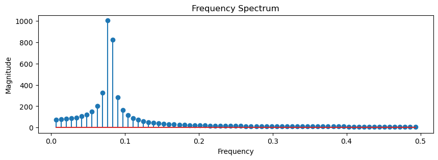

--

- It turns out that the main seasonality was not exactly $12$.
- If we want to generate a periodic signal with seasonality $12$, we have to do as follows.

--

```python
seasonal_12 = 20 + np.sin(2*np.pi*time/12)*20
fft_analysis(seasonal_12)
```

```python
Dominant Frequency: 0.083
Dominant Period: 12.00 time units
```

---

## Summary

In this lecture we covered the following topics:
<ol>
  <li class="fragment">The definition of a time series and examples of time series from the real world.</li>
  <li class="fragment">A practical understanding of the three components of time series data.</li>
  <li class="fragment">The additive, multiplicative, and pseudo-additive models.</li>
  <li class="fragment">Standard approaches to decompose a time series in its constituent parts.</li>
</ol>
