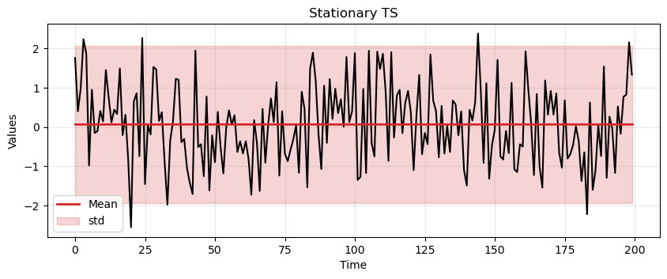
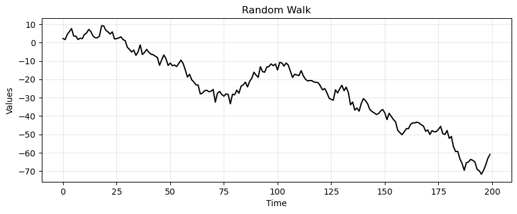

<h1 style="font-size: 3em"> Stationarity </h2>

---

## Introduction

- Previously, we learned that time series is data that is measured at equally-spaced intervals. 
- We also learned that time series data can be decomposed into three parts: trend, seasonality, and residuals. 
- Now we'll dig deeper by discussing an important concept called **stationarity**. 
- Necessary to understand more advanced modeling strategies that we'll introduce later on.

--

In this lecture we will cover
- Definition of stationarity and examples of common stationary and nonstationary time series.
- How to detect stationarity.
- The most common ways to transform nonstationary time series into stationary ones.

---

## Stationary Time Series

--

### Why is stationarity important?

- Stationarity is a fundamental assumption in many time series forecasting models.
- Without it many basic time series models would break.
- Transformations can be applied to convert a nonstationary time series to a stationary one.
- There are advanced time series models that can handle nonstationary data (beyond the scope of this lecture).

---

### What is stationarity?

- 💡 Intuition: a time series is stationary when there are no changes in the underlying system that generates it.
- In the following, we define:
    - Strict stationarity.
    - Weak stationarity.
    - Things to check in practice.

---

#### Strict stationarity

- A stochastic process `$\{X(t): t \in \mathcal{T}\}$` is called *strictly stationary* if, for all $t_1,\dots, t_n \in \mathcal{T}$ and $h$ such that $t_1+h,\dots, t_n+h \in \mathcal{T}$, and for any $n$, it holds that

`$$\big\{X(t_1),\dots, X(t_n)\big\} \stackrel{\text{D}}{=} \big\{X(t_1+h),\dots, X(t_n+h)\big\}$$`

- where $\stackrel{\text{D}}{=}$ indicates that the distributions are equal.

--

Some consequences:
- $n=1 \implies F(x_t)=F(x_{t+h})$
- Which implies that $\mathbb E[x_t]=\mathbb E[x_{t+h}]$
- $n=2 \implies F(x_t,x_s)=F(x_{t+h},x_{s+h})$
- Which implies that `$\text{cov}(x_t,x_s)=\text{cov}(x_{t+h},x_{s+h})$`
- etc.

--

- In plain words, the joint distribution of any set of observations is the same to that of a time-shifted set, regardless of the shift.
- Strict stationarity is very difficult to verify, especially from a limited amount of data.
- For this reason, one checks for *weak stationarity*.

---

#### Weak stationarity

- A time series $X(t)$ is *weakly stationary* if:

  1. The mean is constant over time $\mathbb{E}[X(t)] = \mu, \forall t \in \mathcal{T}$
  2. The variance is finite $\mathbb{E}[X(t)^2] < \infty,\forall t \in \mathcal{T}$
  3. The covariance of $X(t)$ and $X(t+h)$ depends only on $h$, i.e., is shift-invariant in time.
- Strict stationarity implies weak stationarity, but not the opposite.

---

#### Things to check in practice.

1. Constant mean (no trend).
2. Constant variance (no heteroscedasticity).
3. Autocorrelation depending only on $h$.
4. No periodic component

Wait... what's the autocorrelation?

---

#### Autocorrelation

- Autocorrelation measures how much the current time series measurement is correlated with a past measurement. 
- For example, the temperature on day $d$ is often highly correlated with temperature on day $d-1$
- Define first the *autocovariance*

> `$C_{XX}(t_1,t_2):=\mathbb{E}[(X(t_1)−\mu_{t_1})(X(t_2)−\mu_{t_2})]$`

--

The *autocorrelation* is similar
> `$R_{XX}(t_1,t_2):=\mathbb{E}[X(t_1)X(t_2)]$`

The connection with autocovariance is
`$$
    C_{XX}(t_1,t_2) = R_{XX}(t_1,t_2) -\mu_{t_1}\mu_{t_2}
$$`

--

It's common to normalise the autocorrelation and define the *autocorrelation coefficient*

> `$$ \rho_{XX}(t_1,t_2) := \frac{C_{XX}(t_1,t_2)}{\sigma_{t_1}\sigma_{t_2}} $$`

where `$ -1 \leq \rho_{XX}\leq 1 $`

--

- With a stationary time series:
    - covariance depends only on **lag** $h$
    - so the variance is constant
- so $\rho$ depends only on lag $h$

--

- Say you wanted to know if today's temperature correlates more with yesterday's temperature ($h=1$) or the temperature from two days ago ($h=2$)
- You could test this by computing $\rho(h=1)$
- And compare it with $\rho(h=2)$ 
- The process is usually repeated for $N$ different lags

---

### Example (iid white noise)

- Let's start with a simple example of a stationary time series.
- First, we create a variable `time` that defines equally-spaced time intervals.
- Then we'll sample values from a Normal distribution with a mean of 0 and a standard deviation of 1.
- We're creating white noise, which is a (strict) stationary process

--

```python
time = np.arange(200)
stationary = np.random.normal(loc=0, scale=1.0, size=len(time))

# create `ax` before
ax.plot(time, np.ones_like(time)*np.mean(stationary), 
        linewidth=2, color='tab:red', label='Mean')
ax.fill_between(time, 
                np.ones_like(time)*(stationary.mean()-1.96*stationary.std()), 
                np.ones_like(time)*(stationary.mean()+1.96*stationary.std()), 
                color='tab:red', alpha=0.2, label='std')
plt.legend()
```

--



- We can easily check that the white noise has constant mean, constant variance, and no periodicity.
- What about the autocorrelation?

`$$
\text{cov}(X_{t+h},X_t)=
\begin{cases}
\sigma^2 \text{ if } h=0 \\
0 \text{ otherwise}
\end{cases}
$$`

---

### Example (random walk)

- The random walk is one of the most important nonstationary time series.
- It is defined as:

`$$X(t) = X(t-1) + \epsilon_t$$`

- where $\epsilon_t$ are called *innovations* and are iid, e.g., $\epsilon_t \sim \mathcal{N}(0,\sigma^2)$.

--

- Let's create a random walk.

```python
# seed to start series
seed = 3.14

# Random Walk
rand_walk = np.empty_like(time, dtype='float')
for t in time:
    rand_walk[t] = seed + np.random.normal(loc=0, scale=2.5, size=1)[0]
    seed = rand_walk[t]
```

--



- Notice how the current value is highly correlated with the past values
- The random walk is nonstationary
- Why 🤔?